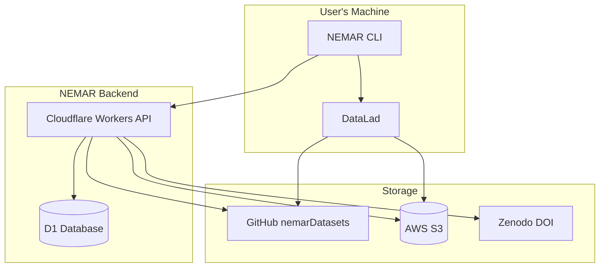
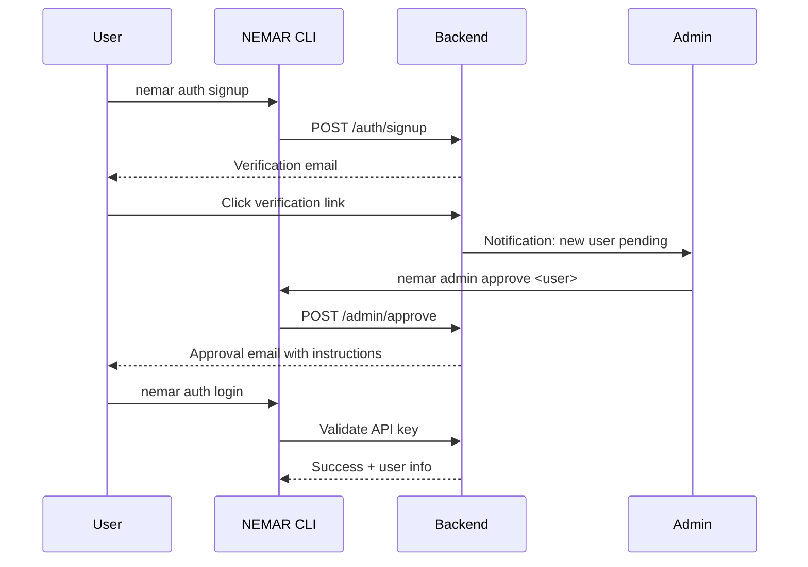
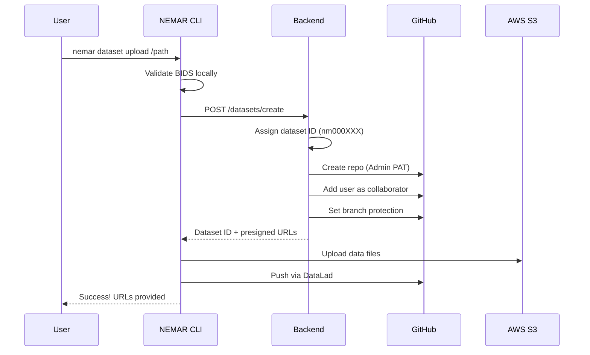
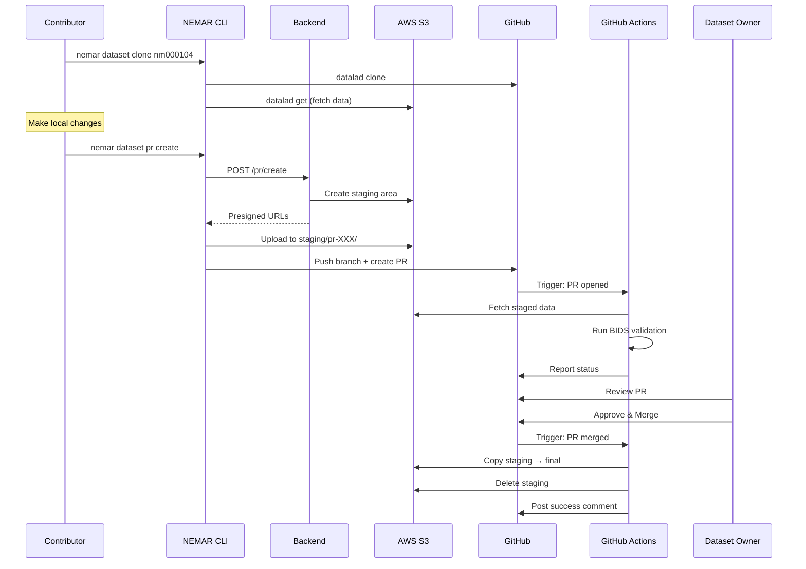
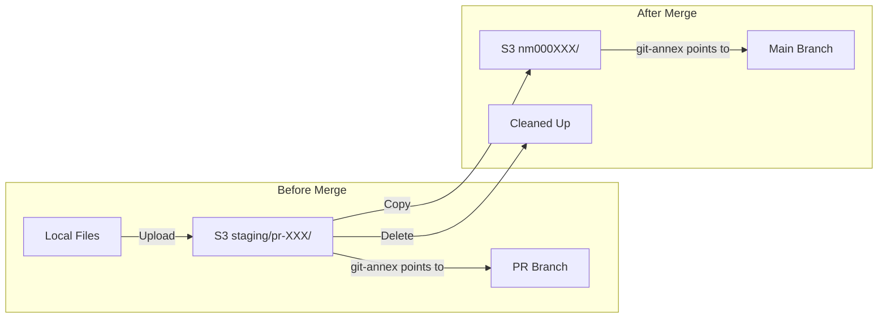
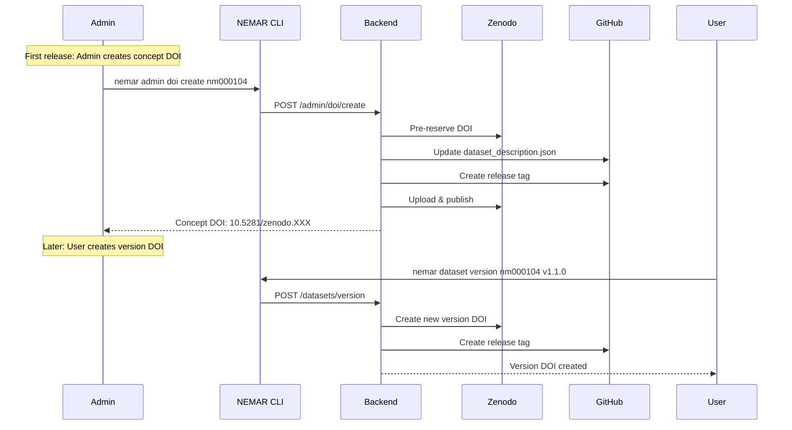
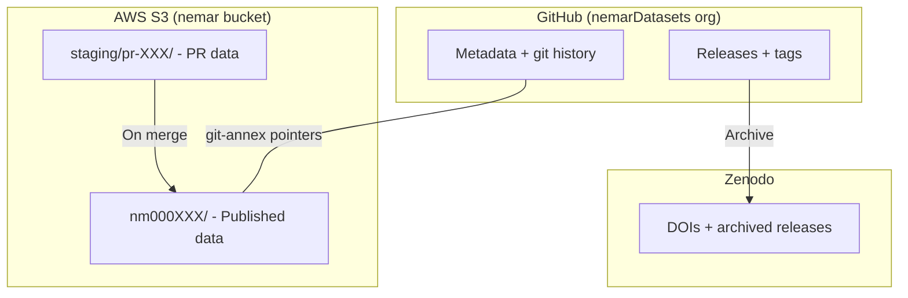

# NEMAR CLI

[](https://nemar-cli.pages.dev)
[](https://github.com/nemarDatasets/nemar-cli/actions/workflows/test.yml)

Command-line interface for [NEMAR](https://nemar.org) (Neuroelectromagnetic Data Archive and Tools Resource) dataset management.

**[Documentation](https://nemar-cli.pages.dev)** | [Quick Start](https://nemar-cli.pages.dev/getting-started/quickstart/) | [Commands](https://nemar-cli.pages.dev/commands/)

## Features

- **Dataset Management**: Upload, download, validate, and version BIDS datasets
- **PR-Based Versioning**: All changes require pull requests (main branch protected)
- **Collaborative**: Any NEMAR user can contribute to any dataset
- **BIDS Validation**: Automatic validation before upload and on PRs
- **DOI Integration**: Zenodo DOI creation for dataset versioning
- **DataLad Backend**: Git-annex for large file management with S3 storage

## Installation

Requires [Bun](https://bun.sh) runtime.

```bash
# Install Bun (if not already installed)
curl -fsSL https://bun.sh/install | bash

# Install NEMAR CLI
bun install -g nemar-cli

# Or run directly without installing
bunx nemar-cli
```

### Prerequisites

For dataset operations:

- [DataLad](https://www.datalad.org/) and git-annex
- [Deno](https://deno.land/) (for BIDS validation)
- GitHub account (for PR collaboration)

```bash
# macOS
brew install datalad git-annex deno

# Ubuntu/Debian
sudo apt-get install git-annex
pip install datalad
curl -fsSL https://deno.land/install.sh | sh
```

## Quick Start

```bash
# 1. Sign up for NEMAR
nemar auth signup

# 2. After admin approval, login
nemar auth login

# 3. Validate your BIDS dataset
nemar dataset validate /path/to/dataset

# 4. Upload to NEMAR
nemar dataset upload /path/to/dataset --name "My Dataset"
```

## Architecture Overview



## Workflows

### User Registration & Authentication



### Dataset Upload (New Dataset)



### Pull Request Workflow (Contributing to Dataset)



### PR Data Flow (S3 Staging)



### Dataset Versioning & DOI



## Commands

### Authentication

```bash
nemar auth signup          # Register new account
nemar auth login           # Login with API key
nemar auth status          # Check authentication status
nemar auth logout          # Clear credentials
```

### Dataset Management

```bash
nemar dataset validate <path>              # Validate BIDS dataset
nemar dataset upload <path>                # Upload new dataset
nemar dataset download <id> [output]       # Download dataset
nemar dataset clone <id> [output]          # Clone for contribution
nemar dataset list                         # List your datasets
nemar dataset list --all                   # List all NEMAR datasets
nemar dataset status <id>                  # Check dataset status
nemar dataset version <id> <version>       # Create new version with DOI
```

### Pull Requests

```bash
nemar dataset pr create                    # Create PR from local changes
nemar dataset pr list                      # List PRs on your datasets
nemar dataset pr list --mine               # List PRs you created
nemar dataset pr show <pr-id>              # View PR details
nemar dataset pr update <pr-id>            # Push updates to PR
nemar dataset pr close <pr-id>             # Close PR without merging
```

### Admin Commands

```bash
nemar admin users                          # List all users
nemar admin users --pending                # List pending approvals
nemar admin approve <username>             # Approve user
nemar admin revoke <username>              # Revoke user access
nemar admin doi create <dataset-id>        # Create concept DOI
```

## Access Control

| Role | Push Branches | Merge PRs | Delete Repos | Create DOI |
|------|--------------|-----------|--------------|------------|
| NEMAR User | All repos | Own datasets | No | Version DOI |
| Dataset Owner | All repos | Own datasets | No | Version DOI |
| Admin | All repos | All datasets | Yes | Concept DOI |

### Key Principles

1. **PR-Mandatory**: Main branch is protected; all changes require PRs
2. **Collaborative**: Any NEMAR user can create PRs on any dataset
3. **Owner Approval**: Only dataset owner (or admin) can merge PRs
4. **No Deletion**: Users cannot delete repositories or S3 data
5. **Audit Trail**: All changes tracked via PR history

## Storage Architecture



## Environment Variables

```bash
NEMAR_API_KEY          # API key (alternative to login)
NEMAR_API_URL          # Custom API endpoint (default: https://api.nemar.org)
NEMAR_NO_COLOR         # Disable colored output
```

## Development

```bash
# Clone repository
git clone https://github.com/nemarDatasets/nemar-cli.git
cd nemar-cli

# Install dependencies
bun install

# Run in development
bun run dev

# Run tests
bun test

# Lint
bun run lint

# Build
bun run build
```

## Related Projects

- [NEMAR](https://nemar.org) - Neuroelectromagnetic Data Archive
- [OpenNeuro](https://openneuro.org) - Open platform for neuroimaging data
- [BIDS](https://bids.neuroimaging.io) - Brain Imaging Data Structure
- [DataLad](https://www.datalad.org) - Distributed data management
- [BIDS Validator](https://github.com/bids-standard/bids-validator) - BIDS validation tool

## License

MIT
