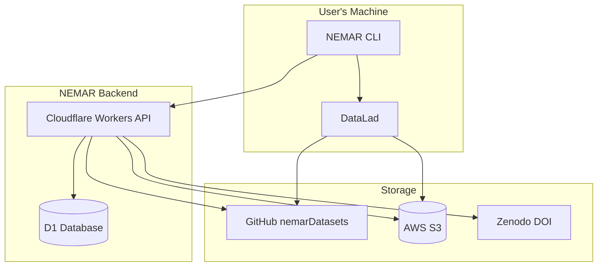
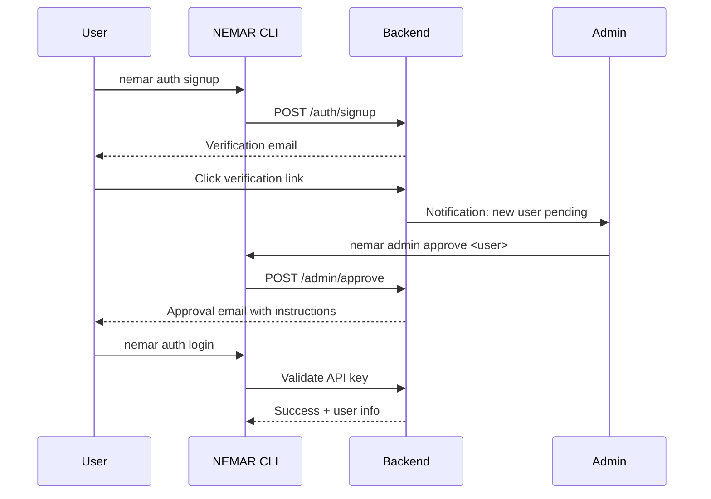
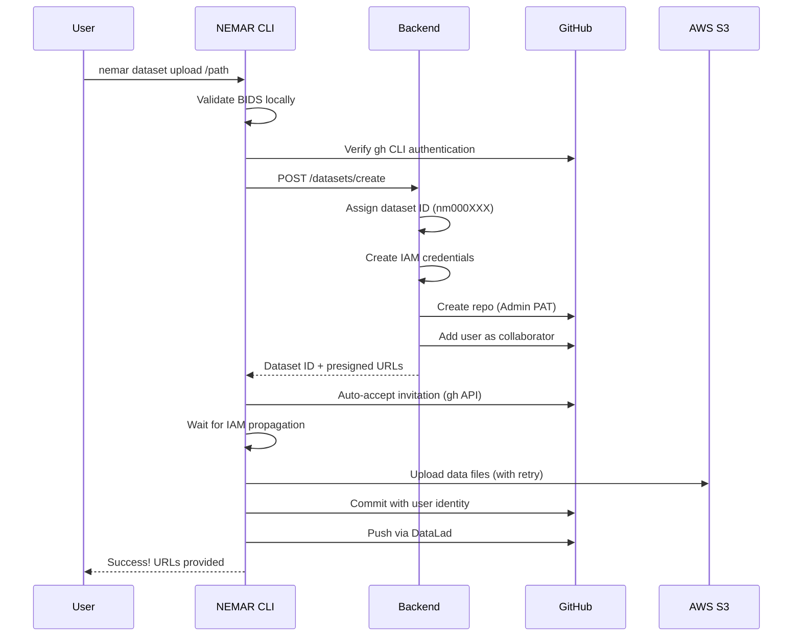
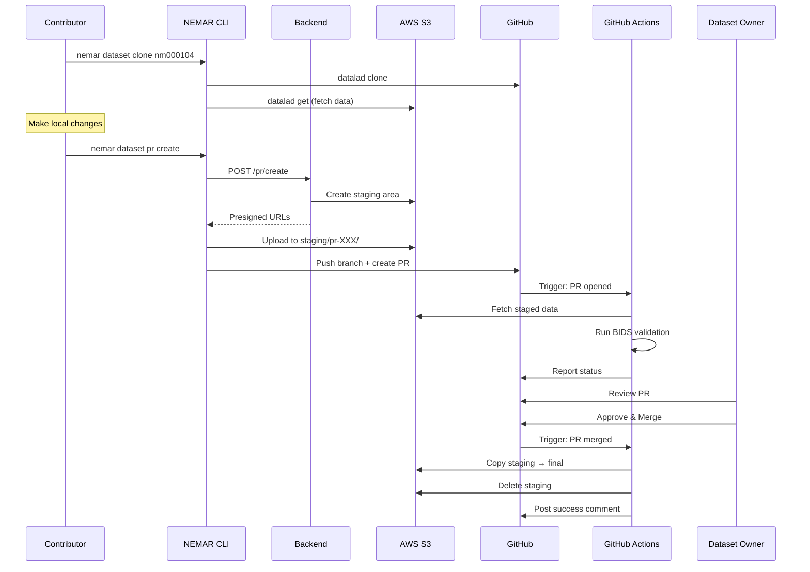
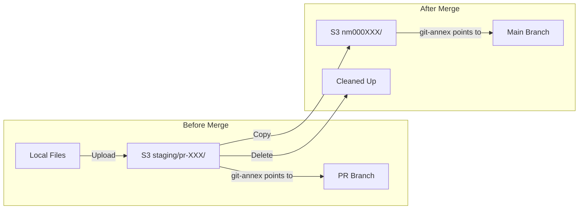
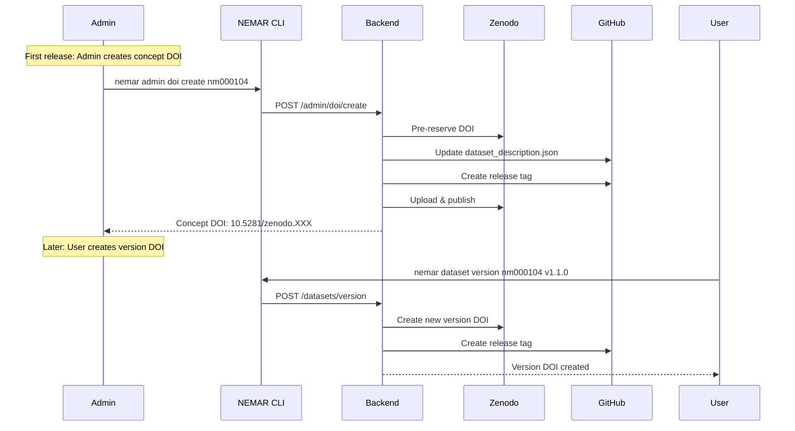
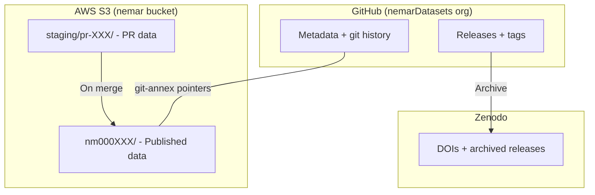

# NEMAR CLI

[](https://creativecommons.org/licenses/by-nc-nd/4.0/)
[](https://docs.nemar.org)
[](https://github.com/nemarOrg/nemar-cli/actions/workflows/test.yml)

Command-line interface for [NEMAR](https://nemar.org) (Neuroelectromagnetic Data Archive and Tools Resource) dataset management.

**[Documentation](https://docs.nemar.org)** | [Quick Start](https://docs.nemar.org/cli/getting-started/quickstart/) | [Commands](https://docs.nemar.org/cli/commands/)

> Documentation now lives in its own repository, [nemarOrg/docs](https://github.com/nemarOrg/docs) (Astro Starlight), and is published at [docs.nemar.org](https://docs.nemar.org).

## Features

- **Dataset Management**: Upload, download, validate, and version BIDS datasets
- **Resume Uploads**: Failed uploads can be resumed; CLI stores state in `.nemar/config.json`
- **Smart Authentication**: Verifies GitHub CLI authentication matches NEMAR user
- **Auto-Accept Invitations**: Automatically accepts GitHub collaboration invitations
- **IAM Retry Logic**: Handles AWS IAM eventual consistency with automatic retries
- **Commit Authorship**: Commits attributed to your NEMAR user identity
- **Private First**: New datasets are private; branch protection applied only on DOI creation
- **PR-Based Updates**: After DOI, all changes require pull requests
- **Collaborative**: Any NEMAR user can contribute to any dataset
- **BIDS Validation**: Automatic validation before upload and on PRs
- **DOI Integration**: Zenodo DOI creation for dataset versioning
- **DataLad Backend**: Git-annex for large file management with S3 storage

## Installation

Requires [Bun](https://bun.sh) runtime.

```bash
# Install Bun (if not already installed)
curl -fsSL https://bun.sh/install | bash

# Install NEMAR CLI
bun install -g nemar-cli

# Or run directly without installing
bunx nemar-cli
```

### Prerequisites

For dataset operations:

- [DataLad](https://www.datalad.org/) and git-annex
- [Deno](https://deno.land/) (for BIDS validation)
- [GitHub CLI](https://cli.github.com/) (`gh`) - authenticated as your NEMAR user
- SSH key registered with GitHub

```bash
# macOS
brew install datalad git-annex deno gh

# Ubuntu/Debian
sudo apt-get install git-annex
pip install datalad
curl -fsSL https://deno.land/install.sh | sh
# Install gh: https://github.com/cli/cli/blob/trunk/docs/install_linux.md

# Authenticate GitHub CLI (required for upload)
gh auth login
```

**Important:** The GitHub account authenticated with `gh` must match your NEMAR username. The CLI verifies this before upload.

## Quick Start

```bash
# 1. Sign up for NEMAR
nemar auth signup

# 2. After admin approval, retrieve your API key
nemar auth retrieve-key

# 3. Login with your API key
nemar auth login

# 4. Complete sandbox training
nemar sandbox

# 5. Validate your BIDS dataset
nemar dataset validate /path/to/dataset

# 6. Upload to NEMAR
nemar dataset upload /path/to/dataset
```

## Architecture Overview



## Workflows

### User Registration & Authentication



### Dataset Upload (New Dataset)



**Note:** Branch protection is NOT applied during initial upload. Private datasets allow direct pushes to main. Protection is applied when creating a DOI (permanent record).

### Resume Failed Uploads

If an upload fails (network issues, S3 errors), you can resume:

```bash
# Just run upload again - CLI detects existing dataset
nemar dataset upload /path/to/dataset
```

The CLI stores dataset metadata in `.nemar/config.json` within your dataset directory. On resume:
1. Detects existing dataset ID from local config
2. Requests fresh presigned URLs from backend
3. Re-uploads files (git-annex handles duplicates)

To start fresh (new dataset ID), remove the config:
```bash
rm -rf /path/to/dataset/.nemar
```

### Pull Request Workflow (Contributing to Dataset)



### PR Data Flow (S3 Staging)



### Dataset Versioning & DOI



## Commands

### Authentication

```bash
nemar auth signup              # Register new account
nemar auth retrieve-key        # Retrieve API key after approval
nemar auth login               # Login with API key
nemar auth status              # Check authentication status
nemar auth switch              # Switch between accounts
nemar auth logout              # Remove active account (--all for all)
nemar auth setup-ssh           # Configure SSH for GitHub
nemar auth regenerate-key      # Request new API key
```

### Dataset Management

```bash
nemar dataset validate <path>  # Validate BIDS dataset
nemar dataset upload <path>    # Upload new dataset
nemar dataset download <id>    # Download dataset (with data)
nemar dataset clone <id>       # Clone metadata only
nemar dataset get [files]      # Download annexed data files
nemar dataset drop [files]     # Free local copies of data
nemar dataset list             # List all datasets (--mine for own)
nemar dataset status <id>      # Check dataset status
nemar dataset release <id>     # Create version bump PR
nemar dataset update [path]    # Push local changes via PR
nemar dataset save             # Stage and commit changes
nemar dataset push             # Push commits and data
nemar dataset ci [id]          # Check BIDS validation CI status
nemar dataset manifest [ver]   # View version manifests
```

### Collaboration

```bash
nemar dataset request-access <id>          # Request collaborator access
nemar dataset invite <user> <id>           # Invite collaborator
nemar dataset collaborators <id>           # List collaborators
```

### Publication Workflow

```bash
# User: Request publication
nemar dataset publish request <dataset-id> # Submit publication request
nemar dataset publish status <dataset-id>  # Check publication status
nemar dataset publish resend <dataset-id>  # Resend admin notification

# Admin: Manage publication requests
nemar admin publish list                   # List all publication requests
nemar admin publish list --pending         # List pending requests only
nemar admin publish approve <dataset-id>   # Approve and publish dataset
nemar admin publish deny <dataset-id>      # Deny publication request
```

### Admin Commands

```bash
# User management
nemar admin users                          # List all users
nemar admin users --pending                # List pending approvals
nemar admin approve <username>             # Approve user
nemar admin revoke <username>              # Revoke user access
nemar admin role <username> <role>         # Change user role

# Dataset management
nemar admin repo public <id>               # Make repo public
nemar admin repo private <id>              # Make repo private
nemar admin ci check <id>                  # Check CI status
nemar admin ci add <id>                    # Deploy CI workflows
nemar admin s3 regenerate-iam <user>       # Regenerate AWS credentials
nemar admin make-public <id>               # Publish dataset (permanent)
nemar admin delete-dataset <id>            # Delete dataset

# DOI management
nemar admin doi create <id>                # Create concept DOI
nemar admin doi info <id>                  # Get DOI info
nemar admin doi update <id>                # Update DOI metadata
nemar admin doi enrich <id>                # Enrich DOI metadata
```

## Access Control

| Role | Push Branches | Merge PRs | Delete Repos | Create DOI |
|------|--------------|-----------|--------------|------------|
| NEMAR User | All repos | Own datasets | No | Version DOI |
| Dataset Owner | All repos | Own datasets | No | Version DOI |
| Admin | All repos | All datasets | Yes | Concept DOI |

### Key Principles

1. **Private First**: New datasets are private; owners can push directly to main
2. **Protection on DOI**: Branch protection applied when creating a DOI (permanent record)
3. **PR-Based Updates**: After DOI creation, all changes require pull requests
4. **Collaborative**: Any NEMAR user can create PRs on any dataset
5. **Owner Approval**: Only dataset owner (or admin) can merge PRs
6. **No Deletion**: Users cannot delete repositories or S3 data
7. **Audit Trail**: All changes tracked via PR history

## Storage Architecture



## Testing

### Running Tests

```bash
# All tests
bun test

# Specific test file
bun test test/cli.test.ts
bun test test/api.test.ts
```

### Zenodo Sandbox Tests

DOI workflows can be tested using Zenodo's sandbox environment without affecting production:

```bash
# Run Zenodo sandbox tests (requires configuration)
RUN_ZENODO_TESTS=true TEST_DATASET_ID=nm099999 bun test test/zenodo-sandbox.test.ts
```

**Setup requirements:**
1. Create account on [sandbox.zenodo.org](https://sandbox.zenodo.org)
2. Generate API token with `deposit:write` scope
3. Add to `test/.env.test`:
   ```bash
   ZENODO_SANDBOX_API_KEY=your_sandbox_token
   RUN_ZENODO_TESTS=true
   TEST_DATASET_ID=nm099999
   ```

**Test coverage:**
- Concept DOI creation and retrieval
- Version DOI publishing workflows
- Metadata updates (title, keywords, related identifiers)
- Error handling (401, 404, 400 responses)
- Rate limiting and request throttling
- Deposition lifecycle (create → upload → publish)
- File uploads with checksum verification

See [the Zenodo testing guide](https://docs.nemar.org/develop/zenodo-testing/) for a comprehensive walkthrough.

## Environment Variables

### CLI Usage

```bash
NEMAR_API_KEY          # API key (alternative to login)
NEMAR_API_URL          # Custom API endpoint (default: https://api.nemar.org)
NEMAR_NO_COLOR         # Disable colored output
```

### Testing

```bash
# Required for Zenodo sandbox tests
ZENODO_SANDBOX_API_KEY # Sandbox Zenodo API token
RUN_ZENODO_TESTS       # Enable Zenodo tests (set to "true")
TEST_DATASET_ID        # Test dataset ID (default: nm099999)

# API testing
TEST_API_URL           # Test API endpoint (dev environment)
TEST_ADMIN_API_KEY     # Admin API key for tests
TEST_USER_API_KEY      # User API key for tests
```

## Troubleshooting

### Upload Issues

**"GitHub CLI not authenticated" or "gh CLI username mismatch"**
```bash
# Login to GitHub CLI with your NEMAR account
gh auth login
# Verify the authenticated username matches your NEMAR username
gh auth status
```
The CLI verifies `gh` is authenticated as your NEMAR user to prevent permission issues.

**"S3 upload failed" or "AccessDenied (403)"**
- AWS IAM policy changes take 10-30 seconds to propagate globally
- The CLI has built-in retry logic (4 retries with progressive delays)
- If retries fail, wait 30 seconds and run upload again
- Admin users don't hit this issue (full bucket access)

**"Failed to accept GitHub invitation"**
- The CLI auto-accepts repo invitations, but `gh` must be authenticated as the invited user
- Manually accept at: https://github.com/nemarDatasets/[dataset-id]/invitations
- Then re-run the upload command

**"Failed to push to GitHub"**
- Check SSH configuration for multiple GitHub accounts
- If you have multiple GitHub accounts, configure SSH host aliases:
  ```bash
  # ~/.ssh/config
  Host github-nemar
    HostName github.com
    User git
    IdentityFile ~/.ssh/id_nemar
  ```
- See `nemar auth status` for SSH setup instructions

**"Dataset already exists" / Resume Upload**
- The CLI stores dataset metadata in `.nemar/config.json`
- To **resume**: just run `nemar dataset upload` again
- To **start fresh** with new dataset ID: `rm -rf /path/to/dataset/.nemar`

**Upload completes but commits show wrong author**
- Commits use your NEMAR user identity (username and registered email)
- Ensure your NEMAR account has correct email registered
- Check with `nemar auth status`

### Authentication Issues

**"API key invalid"**
```bash
nemar auth logout
nemar auth login
```

**"Account pending approval"**
- Admin must approve your account after signup
- Contact your NEMAR administrator

### Branch Protection

**"Cannot push directly to main"**
- If your dataset has a DOI, branch protection is enabled
- All changes require pull requests after DOI creation
- Private datasets without DOI allow direct pushes

**"Branch protection not applied after upload"**
- This is expected for new private datasets
- Protection is applied when admin creates a DOI (`nemar admin doi create`)
- Allows owners to freely modify their private workspace

## Development

```bash
# Clone repository
git clone https://github.com/nemarOrg/nemar-cli.git
cd nemar-cli

# Install dependencies
bun install

# Run in development
bun run dev

# Run tests
bun test

# Lint
bun run lint

# Build
bun run build
```

## Related Projects

- [NEMAR](https://nemar.org) - Neuroelectromagnetic Data Archive
- [OpenNeuro](https://openneuro.org) - Open platform for neuroimaging data
- [BIDS](https://bids.neuroimaging.io) - Brain Imaging Data Structure
- [DataLad](https://www.datalad.org) - Distributed data management
- [BIDS Validator](https://github.com/bids-standard/bids-validator) - BIDS validation tool

## Community and policies

- [NEMAR policies](https://docs.nemar.org/policies/): privacy policy, data contributor terms, GDPR position statement, takedown procedure
- [Code of Conduct](https://github.com/nemarOrg/.github/blob/main/CODE_OF_CONDUCT.md), [Contributing](https://github.com/nemarOrg/.github/blob/main/CONTRIBUTING.md), and [Security policy](https://github.com/nemarOrg/.github/blob/main/SECURITY.md) apply org-wide from [nemarOrg/.github](https://github.com/nemarOrg/.github).
- Help using NEMAR: support@nemar.org. Bugs and feature requests: open an issue on this repository.

## License

This project is licensed under the [Creative Commons Attribution-NonCommercial-NoDerivatives 4.0 International License](https://creativecommons.org/licenses/by-nc-nd/4.0/).

You are free to share (copy and redistribute) the material for non-commercial purposes, with appropriate attribution. No derivatives or adaptations are permitted.
